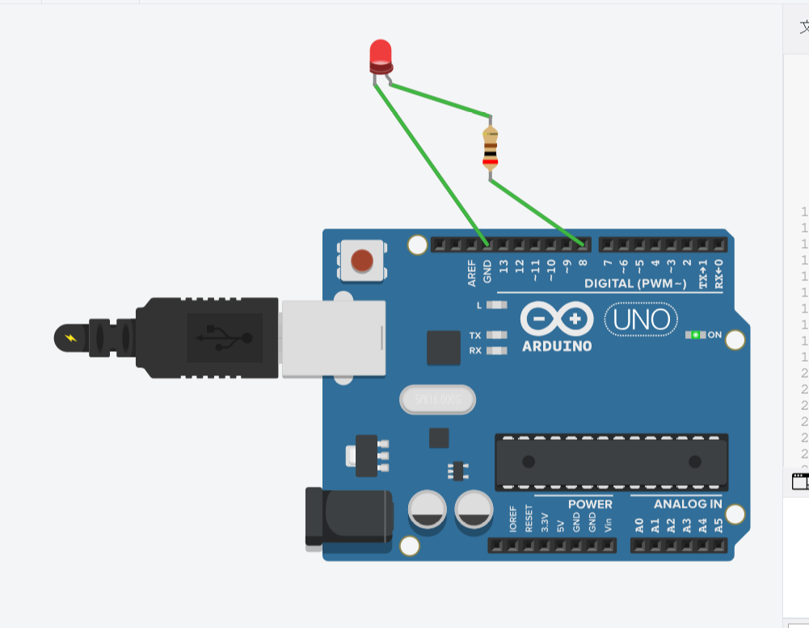
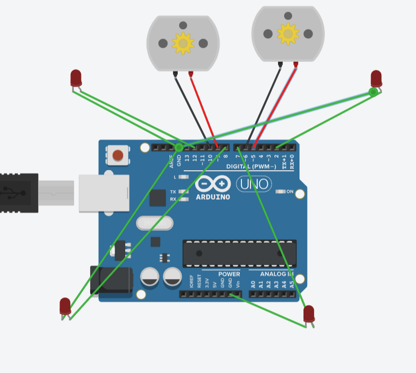
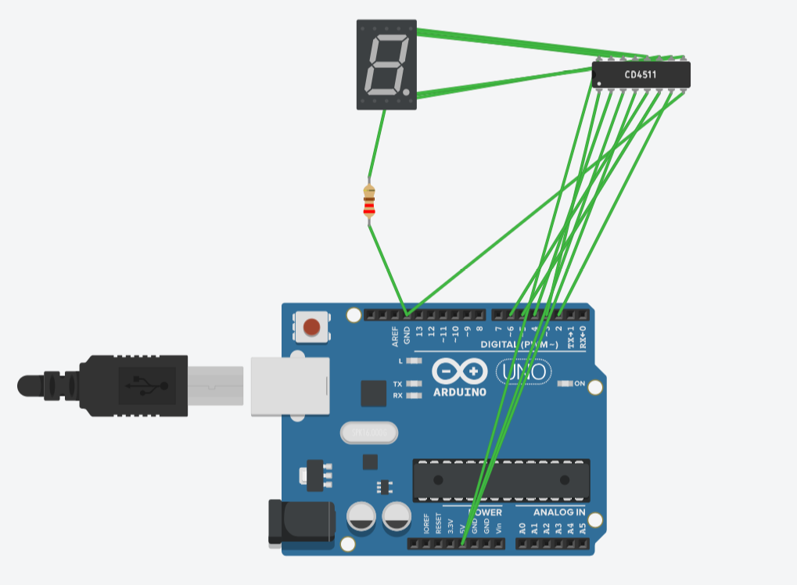
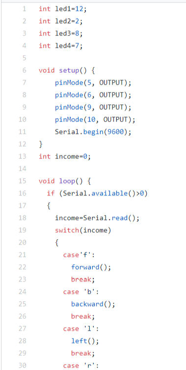

# **西电开源硬件实战总结**

`戴思超`
# **课程内容**
|  日期   |      内容       |     作业     |
|:-------:|:------------- | ----------:|
|   0702  |    入门    |   创建github账号，安装arduino,fritizing,processing              |
|0703|arduino编程|morse代码，库函数形式|
|0704|认识电子元器件及操作|1.小车代码和电路图2.数码管代码和电路图|
|0705|总结|1.摩尔斯代码tinkercard可运行代码2.markdown学习总结|
# **学习心得**
>1.*arduino入门*
>>第一天的学习从老师的自我介绍开始，老师首先给我们进行了自我介绍，并向我们展示了在国外的创客大赛中拍摄的照片，了解到现在开源硬件在小孩，青少年中都开始广泛流行。接着老师向我们展示了github的使用，教会了我们github的基本使用方法，然后用一些简单的例子给我们展示了arduino.fritizing,processing的使用，让我们回去自行安装练习。我回去之后，完成了老师的任务，并进行了一些简单操作，虽然不是很熟练，但也体会到了一丝成功的味道

>2.*arduino编程*
>>第二天首先认识了摩尔斯电码，摩尔斯电码以点线来传递信息，不同的点线代表不同的字符，从而达到简化传递和保密的作用。了解摩尔斯电码后，我们就要利用arduino编程来实现这一过程。在这一过程中我们使用了库函数，即把相应的摩尔斯电码用c编程后，作为一个库函数，在之后编写主体代码时，直接用头文件应用，简化了主体代码的代码量，使得代码更为简洁明了。通过这一天的学习，我学到了摩尔斯电码，以及如何利用库函数进行编程

>3.*认识电子元器件及操作*
>>第三天中。我们利用虚拟环境认识了arduino，电机，电阻，芯片等电子元器件，在老师的指导下，用代码加虚拟环境，模拟出小车电机前进，后退，左转，右转的情况，之后我们又通过自己的努力，加入了led灯，在小车前进，左转等情况下进行相应的灯光变换。然后我们又学习了7段数码管和cd45411芯片，在自己阅读芯片手册，看懂管脚的努力下，通过编写代码，在虚拟环境中模拟出输入0-9，数码管显示相应的数字。在这一天的学习中，我们利用虚拟环境，自己搭建电路，编写代码，最终实现了小车转动+的灯光变换以及数码管和译码器的操作，收获满满。

>4.*总结*
>>由于虚拟环境中不能模拟库函数，所以，今天我们将库函数编写为函数，直接写在主体代码中进行模拟。接着老师介绍了markdown的格式编辑，让我们又学到了一种更加高级的文档编写方式，受益匪浅。

# **成果展示**

Morse电码的虚拟环境实现

小车电机+转向灯的操作

数码管和译码管的操作

部分代码展示
# **课程总结**
>经过四天的紧张学习，我们从刚开始的懵懂到现在的入门，离不开老师的辛勤教诲。开源的arduino在社会上越来越受欢迎，他的简单方便快捷都使得他在日常的操作当中更加便捷，所以我们也应该对开源硬件进行学习和了解其工作原理，为以后进一步学习打下更好的基础。在王老师的课上，我们学到的不仅是开源硬件的基础知识，更多的是学习的方法和理念。在学习过程中，王老师不仅给我们讲述开源硬件的知识，同时带领我们去使用学习在日常工作学习中都有着极大作用的工具，所以这次的双创实践，我学到的不仅是arduino的知识，还有学习的方法和在日常工作中的一些好的习惯和经验，感谢王老师的课程以及学校提供的这次双创周实践课程。